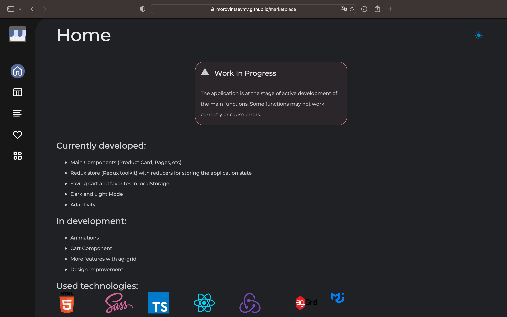
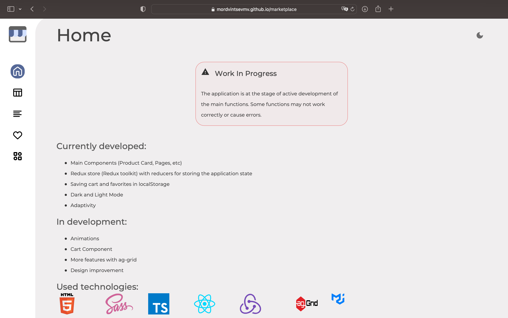
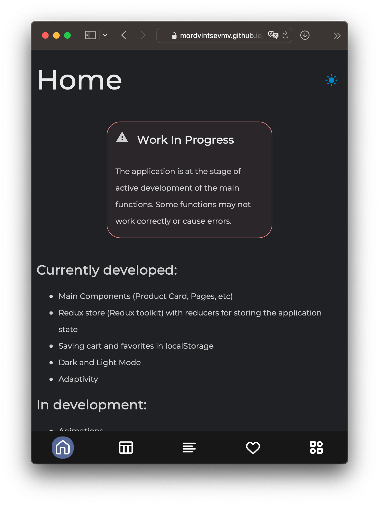
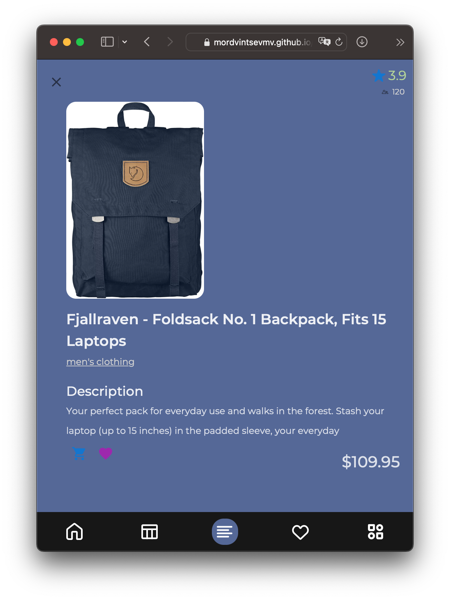

# Marketplace

This is a prototype marketplace for testing the features of React, Redux, Typescript and various libraries.

**Currently developed:**
- [X] Main Components (Product Card, Pages, etc)
- [X] Redux store (Redux toolkit) with reducers for storing the application state
- [X] Saving cart and favorites in localStorage
- [X] Dark and Light Mode
- [X] Responsive Design
- [X] Implemented MUI components into the App


<a href="https://mordvintsevmv.github.io/marketplace" target="_blank">Test App</a>

---

## <a name="content">Content</a>

0. [Design](#design)
   1. [Layout](#design-layout)
   2. [Design - Theme](#design-theme)
   3. [Design - Responsive Design](#design-responsive)
1. [Technologies](#technologies)
1. [ToDo](#todo)
2. [Contacts](#contacts)


---

## <a name="design">Design</a>

### <a name="design-layout">Layout</a>
The <a href="https://dribbble.com/shots/16007150-Drop-Shipping-Platform">DropShipping Platform layout</a> 
was taken as a basis for Design of the Marketplace App.


---

### <a name="design-theme">Design - Theme</a>

Dark Theme:



Light Theme:




To develop the function , the following were used:

- **localStorage** - save user preferences in browser memory
- **Redux Store** - store the current state of the theme and use it in any component of the app.

**Initializing theme:**
```javascript
const getTheme = () => {
    
const theme = `${window?.localStorage?.getItem('theme')}`
   
if ([ 'light', 'dark' ].includes(theme)) return theme

    const userMedia = window.matchMedia('(prefers-color-scheme: light)')
   
    if (userMedia.matches) return 'light'

    return 'dark'
}
```

**Set Theme Function:**
```javascript
export const setTheme = (theme: String) => async (dispatch: Dispatch) => {
    
    dispatch(set(theme))
    localStorage.setItem("theme", theme.toString())
   
}
```

---

### <a name="design-responsive">Design - Responsive Design</a>

The application is adapted to most devices with different display sizes.

CSS **media-queries**, **flex** and **grid** display were used for responsive design.

**Examples:**





[🔝Content🔝](#content)

---

## <a name="technologies">Technologies</a>

<div style="display:flex; justify-content: space-around; align-items: center; gap: 40px">


</div>

[🔝Content🔝](#content)

---

## <a name="todo">ToDo</a>

- [ ] More features with ag-grid

- [ ] Animations

- [ ] Design improvement

- [ ] Search feature

- [ ] Counting items in Cart

- [ ] Refactoring 

[🔝Content🔝](#content)

---

## <a name="contacts">Contacts</a>

**TG**: [@mordvintsevmv](https://t.me/mordvintsevmv)

**e-mail**: mordvintsevmv@gmail.com


[🔝Content🔝](#content)
