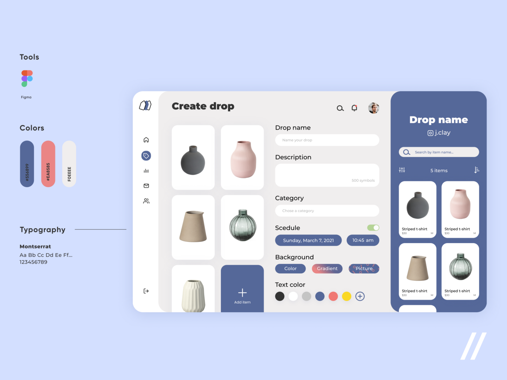

# Marketplace

<a href="https://mordvintsevmv.github.io/marketplace" target="_blank">Test App</a>

---

## <a name="content">Content</a>

0. [Design](#layout)
1. [Technologies](#technologies)
1. [ToDo](#todo)

[🔝Content🔝](#content)

---

## <a name="layout">Design</a>

The <a href="https://dribbble.com/shots/16007150-Drop-Shipping-Platform">DropShipping Platform layout</a> 
was taken as a basis for Design of the Marketplace App.

[🔝Content🔝](#content)

---

## <a name="technologies">Technologies</a>

[🔝Content🔝](#content)

---

## <a name="todo">ToDo</a>

- [ ] More features with ag-grid

- [ ] Animations

- [ ] Cart Component

- [ ] Design improvement

- [ ] Fix Favorite Page 

- [ ] Search feature

- [ ] Refactoring 

[🔝Content🔝](#content)
